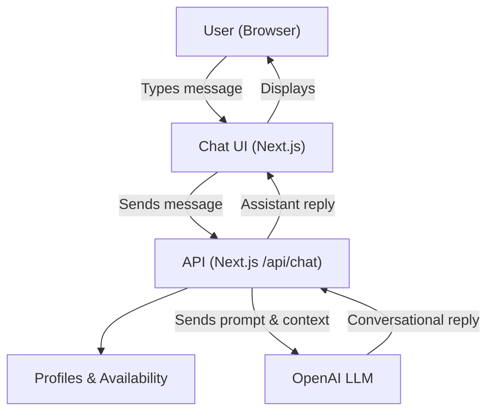

# AI Shortlister

This application is a full-stack AI-powered shortlisting tool built with Next.js and OpenAI's LLM. It allows users to search for Valtechies, ask follow-up questions, and receive conversational, context-aware responses.

## Architecture Overview

The application follows a modern Next.js architecture with the following key components:

### Frontend
- Next.js 13+ with App Router
- React Server Components
- Tailwind CSS for styling
- Real-time chat interface

### Backend
- Next.js API Routes
- OpenAI API integration
- Internal API integration for Valtechie data

### Data Flow
- The API route fetches Valtechie profiles and availability from internal APIs.
- It constructs a system prompt, including chat history and Valtechie data, and sends it to OpenAI's LLM.
- The LLM processes the request and returns a formatted response.
- The response is sent back to the frontend and displayed in the chat interface.

## Features
- Natural language search for Valtechies
- Valtechie search, scoring, and follow-up support
- Real-time chat interface
- Context-aware responses
- Valtechie profile matching

## API Endpoints
- Valtechie Profiles: https://hackathon-test.azure-api.net/profiles/

## Simplified Architecture Diagram



## Dataflow Description

1. **User Interaction:**
   - The user interacts with the chat UI in the browser, typing queries or follow-up questions.

2. **Frontend (Next.js):**
   - The chat UI sends the user's message to the backend API route (`/api/chat`).

3. **Backend API Route:**
   - The API route fetches Valtechie profiles and availability from internal APIs.
   - It merges and scores the data using custom logic.
   - It constructs a system prompt, including chat history and Valtechie data, and sends it to OpenAI's LLM.

4. **OpenAI LLM:**
   - The LLM receives the prompt and context, then generates a conversational, human-like response.

5. **Response Handling:**
   - The backend returns the LLM's response to the frontend.
   - The chat UI displays the assistant's reply to the user.

## Key Features
- Conversational, context-aware AI assistant
- Human-like, friendly responses
- Valtechie search, scoring, and follow-up support
- Modern, intuitive chat UI

---

For setup and usage instructions, see the comments in the codebase or contact the maintainer.

## Features

- Natural language processing of project requirements
- Valtechie profile matching
- Availability checking
- Interactive chat interface
- Detailed match explanations

## Tech Stack

- Next.js 14
- TypeScript
- Tailwind CSS
- OpenAI GPT-4
- React

## Getting Started

1. Install dependencies:
```bash
npm install
```

2. Create a `.env.local` file in the root directory and add your OpenAI API key:
```
OPENAI_API_KEY=your_api_key_here
```

3. Run the development server:
```bash
npm run dev
```

4. Open [http://localhost:3000](http://localhost:3000) in your browser.

## Project Structure

- `/src/app` - Next.js app directory
- `/src/components` - React components
- `/src/services` - API services
- `/src/types` - TypeScript type definitions

## API Integration

The application integrates with two external APIs:
- Valtechie Profiles: https://hackathon-test.azure-api.net/profiles/
- Availability: https://hackathon-test.azure-api.net/availability 